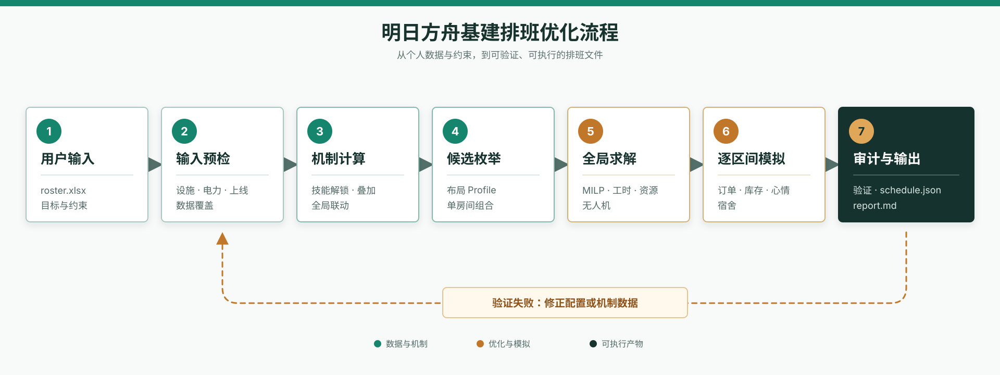

<div align="center">

<h1>ark-base-schedule.skill</h1>

<p><strong>明日方舟基建排班优化.skill</strong></p>

[](LICENSE)
[](https://python.org)
[](https://agentskills.io)
[](https://github.com/KayChung17/arknights-base-skill/stargazers)

[](https://docs.anthropic.com/en/docs/claude-code)
[](https://hermes-agent.nousresearch.com/)
[](https://docs.openclaw.ai/)
[](https://developers.openai.com/codex)

<p><a href="RELEASE_NOTES-2.0.0.md">2.0.0 发布说明</a> · <a href="MIGRATION-2.0.0.md">迁移指南</a></p>

</div>

面向中文用户的明日方舟基建布局、排班、无人机与培养决策工具，帮助你根据自己的干员、上线习惯和资源目标制定可执行的基建方案。

> 本项目是非官方社区工具。游戏名称、角色名称与相关素材权利归其权利人所有。内置数据是版本化快照，不保证覆盖游戏中的全部干员或未来更新。

## 🎯 能解决什么问题

- 根据自己的干员池和练度安排贸易站、制造站、发电站与控制中枢。
- 比较 252、342、333 等布局，也可以搜索自定义房间等级配置。
- 以合成玉、龙门币、赤金、经验、低操作量或自定义权重为目标。
- 把无人机恢复、持有上限、节点分配、资源成本和重复日库存闭环纳入模型。
- 检查同一时间重复进驻、工时、仓库封顶、赤金与碎片收支、龙门币下限和心情风险。
- 长期重复日默认要求赤金与源石碎片日净变化均不低于 0，并在同收益候选中优先更接近收支平衡的方案。
- 比较当前练度、基建技能全解锁上限和定向培养方案。
- 输出可直接导入排班工具的 `schedule.json` 和中文排班报告。
- 将攻略模板作为比较基线，不把模板限制成唯一搜索空间。

## 🧭 工作流程



流程从个人练度与目标约束开始，经输入预检、机制计算和全局求解后，再通过逐区间模拟检查订单、库存、心情与宿舍轮换，最终生成经过审计的排班文件和报告。

## ⚡ 安装

将下面这段话发送给当前使用的 Agent：

```text
帮我安装 arknights-base-skill 这个 skill：https://github.com/KayChung17/arknights-base-skill
```

Agent 会自动识别当前宿主的 skills 目录，将 `ark-base-schedule` 和 `update-ark-skills` 安装到正确位置，并加载对应入口。

## 🚀 如何使用

在 [明日方舟一图流](https://ark.yituliu.cn/) 导出你的干员练度表 `roster.xlsx`，放在项目目录中，然后直接向 Agent 描述目标和限制。例如：

> 读取 `roster.xlsx`，每天上线 3 次，时间可以优化；右侧设施满级且不可调整；希望最大化合成玉，龙门币每天最多亏损 2 万，源石碎片和赤金保持收支平衡；宿舍等级可以调整；菲亚梅塔不启用。

建议同时说明：

- 每天上线次数，以及上线时间是否固定
- 右侧设施等级和是否不可逆
- 无人机上限与当前库存
- 宿舍数量、等级和是否允许调整
- 龙门币可接受的日净变化
- 源石碎片、赤金、经验书等资源是否需要长期平衡
- 特定干员的精英化或等级变化

Agent 会根据这些条件给出布局、上线时间、房间干员、宿舍轮换和资源收益，并提供可直接使用的 `schedule.json` 排班文件。

若已有固定布局，也可以直接说明布局编号和每个房间的产品安排；若更关注培养，可以要求比较当前练度与培养后的收益差异。

## 🛠️ 运行环境

若希望在本地运行仓库，需要 Python 3.10 及以上版本。安装依赖：

```bash
python -m pip install "scipy>=1.11" "openpyxl>=3.1"
```

普通使用者只需要准备干员练度表；仓库会在本地读取该文件，个人数据不会上传。

## 🔒 数据与隐私

- 干员表只在本地读取，不会上传。
- `output/`、常见用户 roster 文件和本地缓存默认被 `.gitignore` 排除。
- 内置 `operator-skills.json` 由全量 `skills_parsed.txt` 构建，当前收录 421 名干员、905 条基建技能。用户拥有状态和练度仅从本地 `roster.xlsx` 读取。
- 未结构化或来源不明的技能不会获得猜测数值。

## 🧩 参与贡献

参见 [贡献指南](CONTRIBUTING.md)、[实际问题复盘](docs/实际问题复盘.md)、[数据维护](docs/数据维护.md) 和 [发布检查清单](docs/发布检查清单.md)。提交新机制时必须附来源、适用版本、单位、作用范围和回归测试。

## 🙏 感谢

非常感谢这些项目和博主的开源与分享：

- [B 站公孙长乐](https://space.bilibili.com/22606843)
- [明日方舟一图流](https://ark.yituliu.cn/)
- [PRTS.WIKI](https://prts.wiki/)
- 以及其他为明日方舟社区提供资料、工具和攻略的开发者与创作者。

## 💬 建议与反馈

欢迎**提出改进建议、反馈 Bug**。提交问题时，建议附上使用的版本、配置片段、错误信息和可复现步骤，便于定位与修复。
